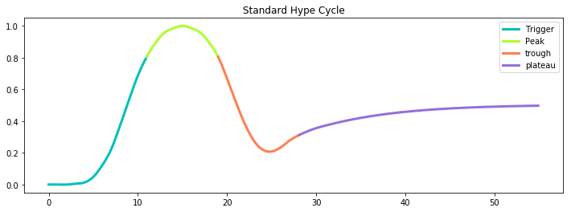
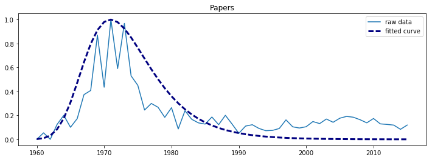
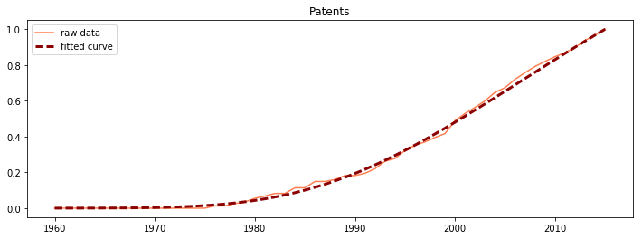
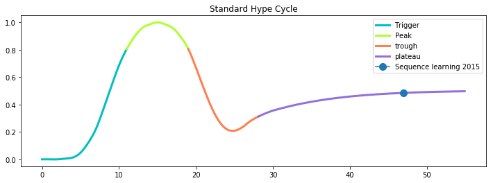

## Hype Cycle 数据 API

API 提供五种数据，分别是：

- 标准 Hype Cycle 座标
- 每个技术的论文数序列，包括原始数据和拟合曲线
- 每个技术的专利序列，包括原始数据和拟合曲线
- 每个技术的 Hype Cycle
- (技术,时间) 在标准 Hype Cycle 的座标

下面对每个方法详细说明。


#### 标准 Hype Cycle 座标



用于画出界面中唯一的 Hype Cycle 曲线。

请求方法：`/std_hype_cycle`

返回结果：一个 Dict，分别是 Hype Cycle 四个阶段的座标列表

緃座标 [0,1] ，横座标 [0, 55]，横座标可以不显示。


#### 论文序列

请求方法：`/papers/<term>`

返回结果：一个 Dict，给定技术的论文数量原始数据和拟合曲线的座标。

緃座标 [0,1] ，横座标 [1960, 2015]。


#### 专利序列



请求方法：`/patents/<term>`

返回结果：一个 Dict，给定技术的专利数量原始数据和拟合曲线的座标。

緃座标 [0,1] ，横座标 [1960, 2015]。


#### 技术的 Hype Cycle


请求方法：`/hype_cycles/<term>`

返回结果：一个 Dict，分别是 Hype Cycle 四个阶段（若存在）的座标列表。

緃座标 [0,1] ，横座标 [1960, 2015]。


#### (技术,时间) 在标准 Hype Cycle 的座标



用于当用户选择技术和时间后，画出界面中唯一的 Hype Cycle 曲线。

请求方法：`/hype_cycles/<term>/<year>`

返回结果：给定技术和时间在标准 Hype Cycle 的座标。pos 和 value 都是和标准 Hype Cycle 里数值一致的。

```json
{
  "pos": 16.2, 
  "value": 0.9813471542086125
}
```

