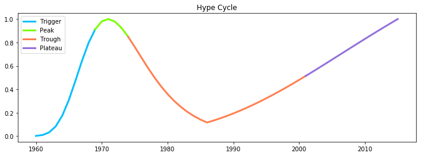

# Hype Cycle 数据 API

API Url 为 http://166.111.5.228:12346

API 提供六种数据，分别是：

- 标准 Hype Cycle 座标
- 每个技术的论文数序列，包括原始数据和拟合曲线
- 每个技术的专利序列，包括原始数据和拟合曲线
- 每个技术的 Hype Cycle
- (技术,时间) 在标准 Hype Cycle 的座标
- 可用的技术术语列表

下面对每个方法详细说明。


## 标准 Hype Cycle 座标


用于画出界面中唯一的 Hype Cycle 曲线。

请求方法：`/std_hype_cycle`

返回结果：一个 Dict，分别是 Hype Cycle 四个阶段的座标列表

```json
{
  "Trigger": [{
		"x": 0.0, 
		"y": 0.0
	}],
  "Peak": [{
		"x": 11.0, 
		"y": 0.804941413
	}],
	"Trough": [{
		"x": 19.0, 
		"y": 0.805352748
	}],
  "Plateau": [{
		"x": 28.1, 
		"y": 0.31242559172273937
	}]
}
```

緃座标 [0,1] ，横座标 [0, 55]，横座标可以不显示。


## 论文序列


请求方法：`/papers/<term>`

例如 /papers/Data_mining

返回结果：一个 Dict，给定技术的名称、论文数量原始数据和拟合曲线的座标。

```json
{
  "term": "Data_mining",
  "raw_data": [{
		"x": 1960, 
		"y": 0.1779534753363229
	}], 
  "fitted_curve": [{
		"x": 1960, 
		"y": 1.6419485833642176e-23
	}]
}
```

緃座标 [0,1] ，横座标 [1960, 2015]。


## 专利序列


请求方法：`/patents/<term>`

返回结果：一个 Dict，给定技术的名称、专利数量原始数据和拟合曲线的座标。格式类似于论文序列。

緃座标 [0,1] ，横座标 [1960, 2015]。


## 技术的 Hype Cycle



请求方法：`/hype_cycles/<term>`

返回结果：一个 Dict，分别是 Hype Cycle 四个阶段（若存在）的座标列表。

```json
{
  "term": "Data_mining",
  "Trigger": [{
		"x": 0.0, 
		"y": 0.0
  }],
  ...
}
```

緃座标 [0,1] ，横座标 [1960, 2015]。


## (技术,时间) 在标准 Hype Cycle 的座标


用于当用户选择技术和时间后，画出界面中唯一的 Hype Cycle 曲线。

请求方法：`/hype_cycles/<term>/<year>`

返回结果：给定技术和时间在标准 Hype Cycle 的座标。pos 和 value 都是和标准 Hype Cycle 里数值一致的。

```json
{
  "pos": 16.2, 
  "value": 0.9813471542086125
}
```


## 技术术语列表

请求方法：`/terms`

返回结果：所有可用技术术语的列表